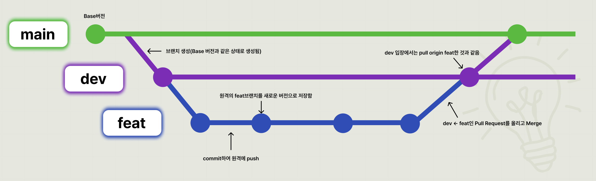

# 🚀 Erbe-Frontend

Erbe Frontend 프로젝트 협업을 위한 Git 및 코드 작성 규칙입니다.

> 자세한 내용은 [`docs/CONVENTION.md`](./docs/CONVENTION.md)를 참고해주세요.

---

# 🛠 Tech Stack

| Category         | Stack            |
| ---------------- | ---------------- |
| Framework        | React 19         |
| Language         | TypeScript       |
| Build Tool       | Vite             |
| Styling          | Tailwind CSS v4  |
| UI               | shadcn/ui        |
| Routing          | React Router DOM |
| State Management | Zustand          |
| Server State     | TanStack Query   |
| HTTP Client      | Axios            |
| Code Quality     | ESLint, Prettier |

---

# 🌿 Branch Convention

안정적인 배포와 독립적인 기능 개발을 위해 Git Flow를 사용합니다.

- 🔵 **main** : 항상 배포 가능한 운영 브랜치
  - 직접 작업 금지
  - Pull Request를 통해서만 병합
- 🟣 **develop** : 다음 배포를 준비하는 통합 개발 브랜치
- 🟢 **feature** : 기능 또는 이슈 단위로 `develop`에서 생성하는 작업 브랜치

<p align="center">
  
</p>

```text
main
 └── develop
      ├── feat/10-login
      ├── feat/11-signup
      ├── fix/15-header
      └── chore/1-eslint
```

---

# 📌 Branch Naming Convention

## 구조

```text
prefix/이슈번호-작업내용
```

## 예시

```text
feat/10-login-api
fix/23-header-layout
docs/5-update-readme
design/12-login-page
refactor/30-user-service
chore/1-eslint-setting
```

| Prefix     | 설명                   |
| ---------- | ---------------------- |
| `feat`     | 새로운 기능 추가       |
| `fix`      | 버그 수정              |
| `hotfix`   | 긴급 버그 수정         |
| `design`   | UI / CSS 수정          |
| `refactor` | 코드 리팩토링          |
| `docs`     | 문서 수정              |
| `chore`    | 설정 파일 및 환경 변경 |

## 작성 규칙

- 영문 소문자와 숫자를 사용합니다.
- 단어 구분은 하이픈 `-`을 사용합니다.
- 브랜치명에는 `#`을 사용하지 않습니다.
- 한 브랜치는 하나의 이슈만 담당합니다.

```text
feat/10-login-api       ✅
fix/23-header-layout    ✅

feat/#10-login          ❌
feature/LoginPage       ❌
```

---

# 📝 Commit Convention

커밋 메시지는 아래 형식으로 작성합니다.

```text
이모지 Type: 작업 내용
```

## 예시

```text
🎉 Start: 프로젝트 초기 설정

✨ Feat: 로그인 API 연결

🐛 Fix: 로그인 버튼 오류 수정

🚑 Hotfix: 배포 환경 로그인 오류 긴급 수정

🎨 Design: 로그인 페이지 스타일 수정

♻️ Refactor: Header 컴포넌트 분리

🔧 Settings: ESLint 및 Prettier 설정 수정

🗃️ Comment: 인증 로직 주석 추가

➕ Dependency/Plugin: React Router DOM 추가

📝 Docs: README 협업 규칙 수정

🔀 Merge: 로그인 기능 브랜치 병합

🚀 Deploy: 운영 환경 배포

🚚 Rename: 사용자 페이지 파일명 변경

🔥 Remove: 사용하지 않는 컴포넌트 삭제

⏪ Revert: 로그인 로직 이전 버전으로 복구
```

| 이모지 | Type                | 설명                             |
| ------ | ------------------- | -------------------------------- |
| 🎉     | `Start`             | 프로젝트 생성 및 초기 설정       |
| ✨     | `Feat`              | 새로운 기능 구현                 |
| 🐛     | `Fix`               | 버그 수정                        |
| 🚑     | `Hotfix`            | 긴급 버그 수정                   |
| 🎨     | `Design`            | UI 및 CSS 변경                   |
| ♻️     | `Refactor`          | 기능 변경 없는 코드 구조 개선    |
| 🔧     | `Settings`          | 개발 환경 및 설정 파일 변경      |
| 🗃️     | `Comment`           | 주석 추가 및 수정                |
| ➕     | `Dependency/Plugin` | 라이브러리 및 플러그인 추가      |
| 📝     | `Docs`              | 문서 추가 및 수정                |
| 🔀     | `Merge`             | 브랜치 병합                      |
| 🚀     | `Deploy`            | 배포 관련 작업                   |
| 🚚     | `Rename`            | 파일 및 폴더 이름 변경 또는 이동 |
| 🔥     | `Remove`            | 파일 및 코드 삭제                |
| ⏪     | `Revert`            | 이전 커밋으로 되돌리기           |

## 커밋 작성 규칙

- 제목 끝에 마침표를 붙이지 않습니다.
- 한 커밋에는 하나의 논리적 변경만 포함합니다.
- `수정`, `작업`, `변경`처럼 모호한 표현만 사용하지 않습니다.
- 가능하면 기능 변경과 스타일 변경을 분리합니다.

```text
🐛 Fix: 버그 수정                         ❌
🐛 Fix: 로그인 요청 중복 실행 오류 수정   ✅
```

---

# 🔀 Workflow

1. `develop` 브랜치를 최신화합니다.
2. `develop`에서 작업 브랜치를 생성합니다.
3. 기능 개발 후 Commit Convention에 맞게 커밋합니다.
4. 원격 저장소에 Push합니다.
5. `develop` 브랜치로 Pull Request를 생성합니다.
6. 팀원들의 코드 리뷰를 진행합니다.
7. 승인 후 **Squash and Merge** 방식으로 병합합니다.
8. Merge가 완료되면 작업 브랜치를 삭제합니다.
9. 배포 시 `develop` 브랜치를 `main`으로 병합합니다.

## Merge 규칙

- Merge 방식은 **Squash and Merge**를 사용합니다.
- 최소 1명의 리뷰 승인을 받습니다.
- 충돌은 Pull Request 작성자가 해결합니다.
- Merge 후 작업 브랜치를 삭제합니다.
- `main`, `develop` 브랜치에 직접 Push하지 않습니다.

---

# 🎨 CSS Convention

프로젝트는 **Tailwind CSS v4 + shadcn/ui**를 사용합니다.

## 기본 규칙

- Tailwind Utility Class를 우선 사용합니다.
- 인라인 스타일(`style={{}}`)은 사용하지 않습니다.
- 공통 UI는 shadcn/ui 컴포넌트를 우선 사용합니다.
- 동일한 스타일이 반복되면 컴포넌트로 분리합니다.
- 반응형은 **Mobile First** 방식으로 작성합니다.
- Tailwind 클래스 오타와 중복을 확인합니다.
- 임의값은 디자인 요구사항이 명확한 경우에만 사용합니다.

자세한 CSS 및 UI 작성 규칙은 아래 문서를 참고해주세요.

➡️ [CSS Convention](./docs/CSS.md)

---

# 📖 More

자세한 협업 규칙은 아래 문서를 참고해주세요.

## 📚 Documents

- 🌿 [Git Convention](./docs/GIT.md)

- 🎨 [CSS Convention](./docs/CSS.md)

- 🌐 [API & State Convention](./docs/API.md)

- ⚙️ [Project Setup](./docs/SETUP.md)
